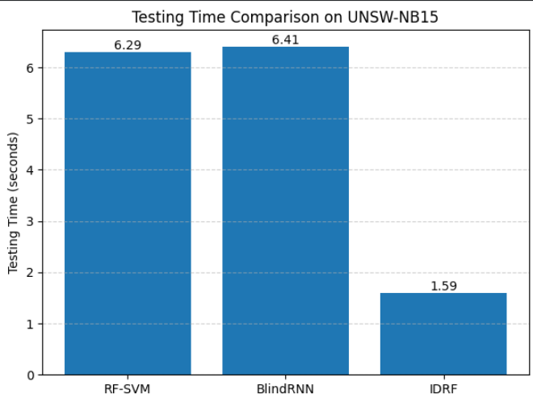
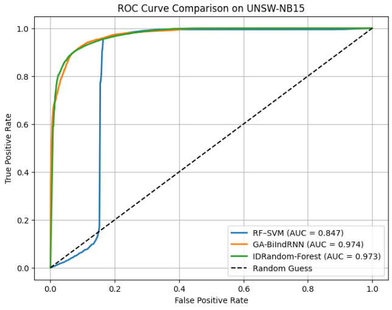

# IDRandom-Forest: Advanced Random Forest for Real-Time Intrusion Detection

## 📌 Overview

This repository presents an implementation and experimental evaluation of **IDRandom-Forest (IDRF)**, an optimized tree-based intrusion detection model designed for **real-time network security applications**.

IDRandom-Forest improves upon traditional Random Forest by integrating:

- Stratified feature sampling  
- Tree contribution analysis  
- ASW (Adaptive Sliding Window) pruning  
- Reduced ensemble size with preserved detection performance  

The primary objective of IDRF is to achieve **high detection capability with minimal computational overhead**, making it suitable for real-time Intrusion Detection Systems (IDS).

---

## 🧠 Core Idea of IDRandom-Forest

In conventional Random Forest models, many trees contribute little to the final decision but significantly increase inference time.

**IDRandom-Forest addresses this problem by:**

1. Evaluating the contribution of each tree using a validation (prune) set  
2. Ranking trees based on their contribution  
3. Iteratively pruning weak trees using ASW pruning  
4. Retaining only high-impact trees for final inference  

This results in a **lighter, faster, and more efficient IDS model**.

---

## 📊 Dataset

- **UNSW-NB15**
- Official training and testing split
- Binary classification:
  - `0` → Normal traffic  
  - `1` → Attack traffic  

⚠️ *The dataset is not included in this repository due to licensing restrictions.*

---

## ⚙️ Experimental Setup

- Language: **Python**
- Execution: **CPU-based**
- Evaluation Metrics:
  - Accuracy
  - Confusion Matrix
  - ROC Curve (AUC)
  - Testing (Inference) Time

---

## 🚀 Experimental Results (IDRandom-Forest)

### ⏱️ Testing Time (Inference Performance)

IDRandom-Forest demonstrates **significantly lower inference time**, validating its suitability for real-time deployment.

| Model | Testing Time (seconds) |
|------|------------------------|
| **IDRandom-Forest** | **1.59 s** |
| **BiIndRNN** | **6.41 s** |
| **SVM** | **6.29 s** |

#### 🔽 Testing Time Comparison

---

### 🔍 Confusion Matrix (IDRandom-Forest)

The confusion matrix shows that IDRF:
- Accurately detects attack traffic  
- Produces fewer false positives for normal traffic  

This is crucial for real-world IDS where excessive alerts can overwhelm security analysts.

---

### 📈 ROC Curve (Detection Capability)

The ROC curve illustrates that IDRandom-Forest achieves **strong discriminative performance**.

- **ROC–AUC ≈ 0.973**

Despite its lightweight structure, IDRF performs comparably to more complex deep learning models.

---

## 🧪 Key Observations

- IDRandom-Forest achieves **high attack detection performance**
- ASW pruning effectively removes low-impact trees
- Inference time is significantly lower than hybrid and deep learning models
- Tree-based decision logic enables fast and scalable deployment

---

## 🏆 Final Conclusion

> **IDRandom-Forest provides the best balance between detection performance and computational efficiency, making it highly suitable for real-time intrusion detection systems.**

While deep learning and hybrid models may achieve marginally higher accuracy, their higher inference latency limits real-time applicability. IDRandom-Forest achieves competitive detection performance with substantially lower computational cost.

---

## 📂 Repository Contents

- IDRandom-Forest implementation
- ASW pruning mechanism
- Evaluation and visualization scripts
- Experimental results and plots

---

## 📚 Citation

> *M. Azhar, S. Perveen, A. Iqbal and B. Lee, "IDRandom-Forest: Advanced Random Forest for Real-Time Intrusion Detection," in IEEE Access, vol. 12, pp. 113842-113854, 2024, doi: 10.1109/ACCESS.2024.3443408.*

---

## 👤 Author

**Revanth L**

